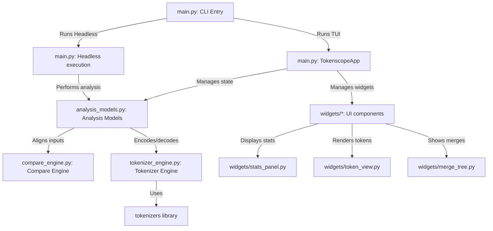

# Architecture Overview

`tokenscope` is a terminal user interface (TUI) and command-line analyzer designed for inspecting, comparing, and benchmarking tokenizers (e.g., from the Hugging Face `tokenizers` library). 

This document outlines the system architecture, file structure, and design principles of the codebase.

---

## Component Diagram

---

## Core Modules

### 1. `main.py`
The orchestrator and user interface of `tokenscope`. It handles:
- Command-line argument parsing (`argparse`).
- Headless execution (stdin streaming, batch analysis, HTML/CSV/Markdown reports generation).
- Instantiating and running the Textual app (`TokenscopeApp`).
- Coordinating asynchronous tasks like background tokenizer loading and text re-encoding.

### 2. `tokenizer_engine.py`
A robust wrapper around Hugging Face’s `tokenizers` library. Key responsibilities:
- Standardizing the interface for different model architectures (BPE, WordPiece, WordLevel, Unigram).
- Resolving local tokenizer file paths (searching for `tokenizer.json`, `tokenizer_config.json`, etc.).
- Providing on-demand downloads from the Hugging Face Hub (`load_from_hub`) with automatic cache-dir routing.
- Time-based speed benchmarking of encoding loops (`benchmark`).
- Converting raw characters into byte-level symbol representations (e.g. GPT-2 style byte-fallback characters).

### 3. `compare_engine.py`
The logic that compares two tokenizers encoding the same piece of text:
- Matches character spans between primary and comparison tokenizations.
- Detects alignment boundary mismatches (e.g., when one tokenizer splits a word differently than the other).
- Identifies token string mismatches, ID mismatches, and missing token slices.

### 4. `analysis_models.py`
The data representation and analytical core. It remains entirely independent of the UI layer to allow headless/CLI execution. Responsibilities:
- Estimating costs based on input token counts and `PricingProfile` tables.
- Rendering chat templates (Jinja2) to compute prompt budget remaining.
- Simulating RAG chunking strategies with overlaps.
- Simulating prompt packing/truncation against specified sequence lengths.
- Inspecting unicode normalization states (e.g., finding zero-width spaces or combining diacritics).
- Formulating the export payload dictionary and serializing it to JSON, CSV, Markdown, or HTML.

### 5. `config.py`
Handles configuration persistence:
- Loads default configurations from `~/.tokenscoperc` or a workspace-local `.tokenscoperc`.
- Validates user settings (export formats, budget limits, tokenizer paths).
- Writes new default config files through the `init-config` subcommand.

---

## UI Components (`widgets/`)

`tokenscope` uses a component-driven architecture built on Textual:
- **`FolderBrowser`**: A customized directory explorer for selecting local folders and model config files.
- **`TokenView`**: Renders the input text colorized by token boundary, supporting selection and cursor-keyboard navigation.
- **`MergeTreeWidget`**: Displays step-by-step merge hierarchies or BPE sequences, and summarizes benchmarks.
- **`StatsPanel`**: Displays vocabulary size, compression ratio, chars/token, and highlights budget exhaustion alerts.
